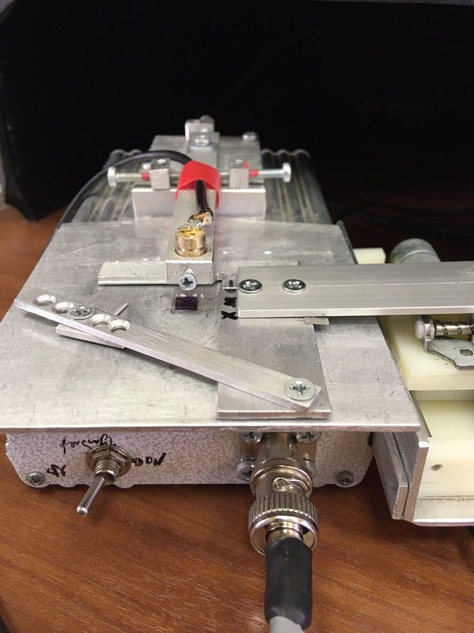
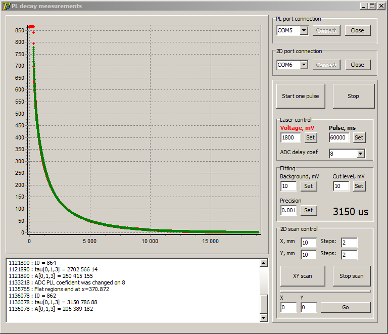

# PL_decay_measurements
My project for photoluminescence decay measurements (STM32 + Delphi)

Developed for a study of silicon wafer passivation. Uses in solar cells technology.

Based on STM32F303 ultra fast ADC allows to measure fast signal transients up to 10 microseconds. Low noise external amplifier with battery power source provides an extreamly sensitivity. InGaAs ultra fast photodiode converts IR photolumiscence from silicon to electric current. Delphi based GUI App recieves raw data from the device and performes math processing for a decay coefficients (up to three) extraction.
